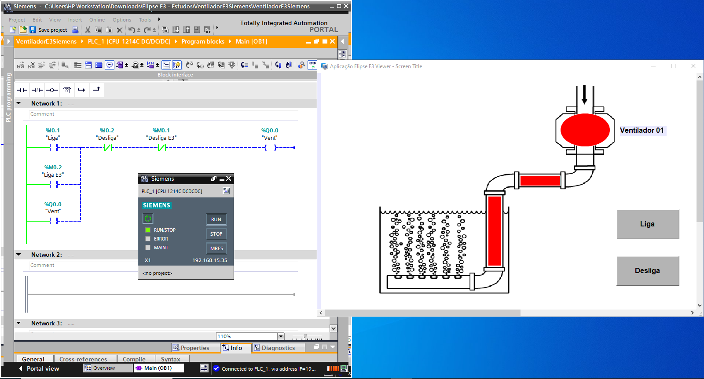
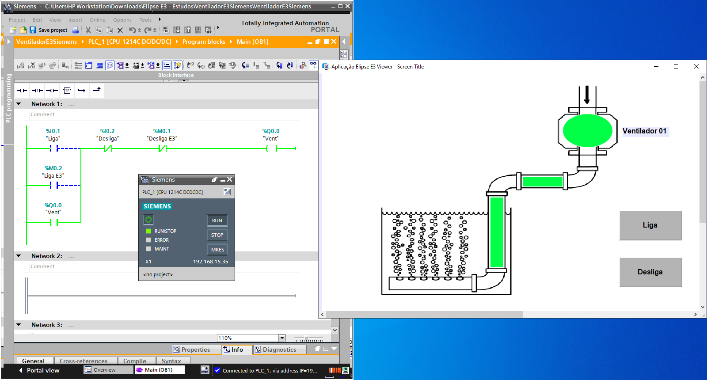

# VentiladorSimples_TiaPortalV14_S71200_ElipseE3
Projeto Simples para Integração de comunicação entre um CLP Siemens 1200 e uma aplicação de supervisão SCADA Elipse E3.

Realizado uma programação de CLP em Ladder com o acionamento via entrada digital em manual, acionamento via supervisão SCADA e saidas digitais para acionamento direto de um ventilador.
Lista de I/O:
-Liga	Bool	%I0.1
-Desliga	Bool	%I0.2
-Desliga E3	Bool	%M0.1
-Ventilador	Bool	%Q1.0
-Liga E3	Bool	%M0.2

Simulação:
-Utilizado um Drive de comunicação M-plot no Elipse E3 para comunicação com o CLP Siemens.
-Utilizado o app NetToPlcSim para simular a comunicação do Simulador PlcSim v14 com a aplicação SCADA.

Referencias:
-https://www.youtube.com/watch?v=fwFEX0HvFyI
-https://www.youtube.com/watch?v=Xn-uOL524wU
-https://www.youtube.com/watch?v=HDoTAG0tN8s&t=1540s

 
  
 
    
   

 
  
 
    
